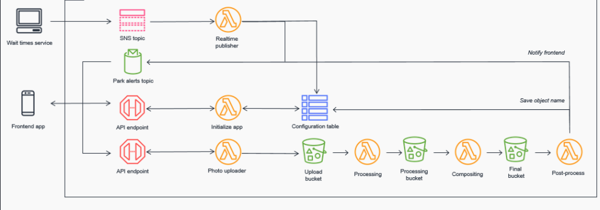

## INTRODUCTION

In this tutorial series we will be bulding a serverless progressive web application for a travel agency that offers varied excursions to attractive tourist sights. This agency also wants to roll out a mobile app that will provide visitors with useful real-time data: wait times, photo and experience opportunities, alerts and notifications, translation services. We will be using AWS as a cloud provider. You should be good doing this project under AWS free tier without incurring any extra charges.

Since we will proceed on the basis that we have already built the application, you can build whatever kind of similar serverless application you like following a similar workflow.

This is not a step-by-step tutorial with a fixed codebase. The emphasis and intention of these posts is to emphasize the broad range of possibilities that serverless offers for the development lifecycle of a full-stack application. Therefore, your goal as a reader should be to understand the architecture behinf the application, not every line of code. Understanding the architecture is key for the development of application that may have a similar functionality.

### FRONTEND

An existing JS (you can use Vue, React, Angular...) app managed with [AWS Amplify Console][amplify-console] that interacts with services on the backend. Amplify will deploy and host our frontend resources: HTML, CSS, JS, images... Also, Amplify will ensure that we follow a continuous deployment pipeline.

### BACKEND

The backend application architecture uses [AWS Lambda][lambda], [Amazon API Gateway][api-gw], [Amazon S3][s3], [Amazon DynamoDB][dynamodb], and [Amazon Cognito][cognito].

Our frontend will receive data from a public backend API (API Gateway and Lambda). DynamoDB will be used as the database. Your DynamoDB table contains information about the excursions that the agency offers. The data will be fetched with Lambda functions, and API Gateway will be used to create a public http endpoint that the frontend will query. This endpoint will be responsible for querying our lambda function.

| Post # | Feature                             | Description                                                 |
| ------ | ----------------------------------- | ----------------------------------------------------------- |
| 2      | Deploy the App                      | Deploy both the frontend and the backend.                   |
| 3      | Wait times                          | Allow tourists to see wait times.                           |
| 4      | Photos                              | Build a photo processing flow.                              |
| 5      | Translation                         | Help international guests.                                  |
| 6      | Analyzing visitor stats             | Collecting and analyzing large amounts of data from guests. |
| 7      | Developing event-based architecture | Routing park maintenance events depending upon severity.    |
