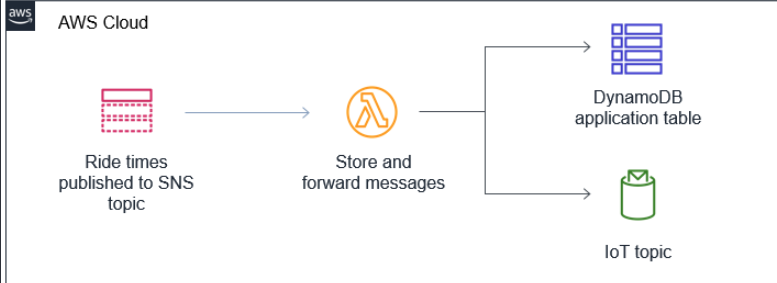

## Real-Time Data Fetching

With this Covid-19 and social-distancing situation we are all used to receiving estimated wait times at the supermarket, local shop, gas station... Live wait times have always been an intrinsic component of real-time applications and, nowadays Internet of Things makes things a lot easier.
There are multiple ways to enable frontend and backend interaction: synchronours request and response, websockets, asynchronouos with webhooks... In this post, however, we will look at a realtime pub/sub over MQTT.



After deploying our application on part 2, now we want to create a publisher-subscriber model. For that matter we will use [Amazon Simple Notification Service](https://aws.amazon.com/sns/) to trigger a Lambda function every time that a new notification arrives to the SNS topic. This function will parse out the message and store the notification message in a DynamoDB table and forward the request to [AWS IoT Core](https://aws.amazon.com/iot-core/). Our frontend will listen to this IoT endpoint, which will update our data.

In case you want to simulate a system for fetching real-time data, you can setup a backend controller to send a SNS notification and simulate application traffic.

```javascript
const AWS = require("aws-sdk")
AWS.config.update({ region: process.env.AWS_REGION })
const TopicArn = process.env.TopicArn

const sendSNS = async Message => {
  // Send to SNS
  try {
    const result = await new AWS.SNS({ apiVersion: "2010-03-31" })
      .publish({
        Message: JSON.stringify(Message),
        TopicArn,
      })
      .promise()
    console.log("SNS result: ", result)
  } catch (err) {
    console.error(err, err.stack)
  }
}

module.exports = { sendSNS }
```

Now you only have to invoke your Lambda function whenever a notification arrives.

- The Lambda function receives new updates as an event payload and parses out the latest message from the SNS topic. It then stores the message in a DynamoDB table and forwards to an IoT topic.
- The DynamoDB table only stores the last message. This initial state is needed when the front-end application is first loaded.
- The IoT topic connects the serverless backend to the front-end application. Any messages posted here will be received by the front-end.

Since our Lambda is connected to AWS IoT Core, we need to set up a few environment variables:

- `IOT_DATA_ENDPOINT`: the IoT endpoint hostname.

```bash
aws iot describe-endpoint --endpoint-type iot:Data-ATS
```

- `IOT_TOPIC`: The name of the IoT topic to publish messages to, which is `theme-park-rides`.

- `DDB_TABLE_NAME`: The name of the application's DynamoDB table.

```bash
aws dynamodb list-tables | grep backend
```

## Lambda SNS listener

- Store the latest received message in a DynamoDB table

```javascript
const saveToDDB = async function(message) {
  try {
    await ddb
      .put({
        TableName: process.env.DDB_TABLE_NAME,
        Item: {
          partitionKey: "config",
          sortKey: "waittimes",
          message: message,
        },
      })
      .promise()
    console.log("saveToDDB success")
  } catch (err) {
    console.error("saveToDDB error: ", err)
  }
}
```

- Publish the notification to the IoT topic

```javascript
const iotPublish = async function(topic, message) {
  try {
    await iotdata
      .publish({
        topic,
        qos: 0,
        payload: JSON.stringify(message),
      })
      .promise()
    console.log("iotPublish success")
  } catch (err) {
    console.error("iotPublish error:", err)
  }
}
```

Finally, the handler

```javascript
exports.handler = async event => {
  const message = JSON.parse(event.Records[0].Sns.Message)
  console.log("From SNS:", message)

  // Save ride time summary to DDB
  if (message.type === "summary") {
    await saveToDDB(message.msg)
  }
  await iotPublish(process.env.IOT_TOPIC, message)

  return message
}
```

## Frontend Updates

In order to update the frontend we need to listen to the IoT topic. Therefore, we need to know the IoT endpoint hostname and the Cognito Identity Pool ID. We will fetch those values and update our frontend config file:

```bash
aws cognito-identity list-identity-pools --max-results 10
aws iot describe-endpoint --endpoint-type iot:Data-ATS
```

- `poolId`: set to the **IdentityPool Id** from the section above.
- `host`: set to the **IoT endpoint hostname** from the section above.
- `region`: set to your **AWS_REGION** from the section above (e.g. `'eu-central-1'`).

Just like we did in the previous post, commit to CodeCommit and deploy to Amplify (a new build will be automatically started):

```bash
git commit -am "Module 2"
git push
```

Once your application has been published, go to the URL provided by Amplify and test the new functionality that you just added. In our example we will be able to see the realtime wait times on the map displayed by our frontend. Notice that you can choose the time interval to update the SNS topic, although we will use 1 minute as our default.

In the upcoming post we will start looking at photo processing so that tourists and guests can save their memories.
