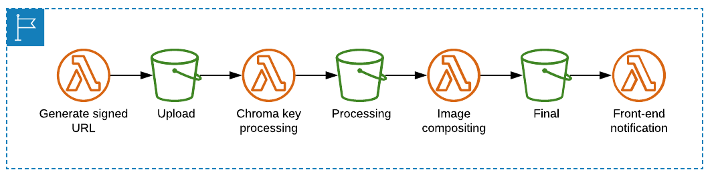

## Photo Processing

In this part we will allow users of our aplpication to take pictures and see a composited picture in the applicaiton. After that they can share the image on social media

## Step-By-Step

1. The frontend call an API endpoint to get a presigned URL to upload the photo to S3 (no need to use any server!) This results in a new object in a S3 bucket.
2. When an object is writtent to the bucket, this event will trigger a Lambda function. The function uses Chromakey to remove the green background from the picture. This new picture will be uploaded to another bucket.
3. Once the processed object is written to the bucket. another lambda functin will composite the picture with a new background and upload it to the final bucket.
4. Whenever the final image is written to this third bucket, the final lambda function will send a notification to IoT core to inform that the file is ready.



This makes up a total of 3 lambda functions and 3 buckets (upload-bucket, processing-bucket, final-bucket).

As far as Lambda is concerned we will use 3 different runtimes in order to:

1. Create of the Chromakey function
2. Create of the Composition function
3. Create of the post-processing lambda function

### Chromakey (Python 3.6)

This function takes an image and removes the green background using a Python library called OpenCV.

The environment variables that we need are:

- `OUTPUT_BUCKET_NAME`: the name of the bucket where the output object is stored.
- `HSV_LOWER`: A tuple representing lower HSV value for the green screen chroma key matching process.
- `HSV_UPPER`: A tuple representing upper HSV value for the green screen chroma key matching process.

We can get the bucket name running:

```bash
aws s3 ls | grep theme-park-backend-processingbucket
```

Since we are using an image processing library, it is important that we change the memory to 3008 MB and the timeout values to 0 minutes and 10 seconds.

Test the function by uploading an image to your upload bucket

```bash
aws s3 cp ./green-screen-test.png s3://youruploadbucketname
```

Check that the resulting image has been modified by removing the green background

### Image Composition

This function uses NodeJS as the runtime and takes the processed image from the Chromakey function and composites various graphic elements into a final image.

Instead of using the Lambda console, since we are going to use multiple libraries and packages, it will be easier for us to use the Serverless Application Model in order to automate the package and deployment of this function.

The SAM template file is a configuration file that takes input in either JSON or YAML. We can declare our ressources in this config file.

- Parameter: name of the final bucket
- Resources:
  - Composite function
  - Runtime and memory size
  - FinalBucketName environment variable
  - IAM policy to allow Lambda to access the S3 bucket

```bash
sam build

sam package --output-template-file packaged.yaml --s3-bucket $s3_deploy_bucket

sam deploy --template-file packaged.yaml --stack-name theme-park-photos --capabilities CAPABILITY_IAM --parameter-overrides "FinalBucketName"=$FINAL_BUCKET

```

Once the function is created we need to add the S3 trigger.

Test the function using a test image containing a photo of a person against a green background. You will copy this image into the upload bucket, and see the final result in the final bucket.

```bash
aws s3 cp ./green-screen-test.png s3://$UPLOAD_BUCKET
```

Next, create the post-process Lambda function to store result in DynamoDB and notify the front-end.

The final Lambda function in the photo processing pipeline is triggered when the final image is rendered and saved into the S3 final bucket. It will save the photo object information into DynamoDB and send a message to the IoT topic so the frontend application is notified.

This function uses three environment variables:

- `IOT_DATA_ENDPOINT`: the IoT endpoint hostname.
- `DDB_TABLE_NAME`: the DynamoDB table name used by the application.

```bash
aws iot describe-endpoint --endpoint-type iot:Data-ATS
aws dynamodb list-tables | grep backend
```

### Push to CodeCommit and deploy via Amplify

```bash
git commit -am "Photo compositing"
git push
```

After the commit is completed, go to the [Amplify Console](https://console.aws.amazon.com/amplify/) and a new build will be automatically started. Next, open the published URL in the browser.

Finally, test your function with your smartphone. You can do this by taking a selfie with a green background. Open the URL from Amplify in your smartphone, add the selfie to your custom app and when it is uploaded the frontendapplication will notify you that the composited picture is ready to view. A Gallery icon might appear in the toolbar so that users can click and view the result.
